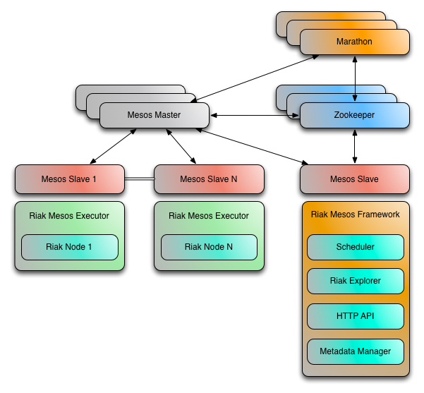

[](https://travis-ci.org/basho-labs/riak-mesos)

# Riak Mesos Framework [in beta]

An [Apache Mesos](http://mesos.apache.org/) framework for [Riak KV](http://basho.com/products/riak-kv/), a distributed NoSQL key-value data store that offers high availability, fault tolerance, operational simplicity, and scalability.

**Note:** This project is an early proof of concept. The code is a beta release and there may be bugs, incomplete features, incorrect documentation or other discrepancies.

## Quick Links

* [Installation](#installation)
    * Open Source Mesos Users (Non-DCOS)
        * [docs/MESOS_USAGE.md](docs/MESOS_USAGE.md)
    * DCOS Users
        * [Setup DCOS CLI](#setup-dcos-cli)
        * [Create a Configuration File](#create-a-configuration-file)
        * [Install the Riak Service](#install-the-riak-service)
        * [CLI Usage](#cli-usage)
        * [Add Riak Nodes](#add-riak-nodes)
        * [Accessing Your Riak Nodes](#accessing-your-riak-nodes)
        * [Uninstalling](#uninstalling)
* [Architecture](#architecture)
    * [Scheduler](#scheduler)
    * [Director](#director)
* [Development / Contributing](#development--contributing)

### Other Documentation

* [Development Guide](docs/DEVELOPMENT.md)
* [Director](docs/DIRECTOR.md)
* [HTTP API](docs/HTTP-API.md)

## Installation

### Create a Configuration File

For the framework to work properly in your environment, a custom config file
may need to be used. Here is a minimal example:

`dcos-riak.json`

```
{
    "riak": {
        "master": "zk://leader.mesos:2181/mesos",
        "zk": "leader.mesos:2181",
        "user": "root",
        "framework-name": "riak",
        "flags": "",
        "node": {
            "cpus": 1,
            "mem": 8000,
            "disk": 20000
        }
    }
}
```

#### Ubuntu (14.04) Configuration

```
{
    "riak": {
        "master": "zk://leader.mesos:2181/mesos",
        "zk": "leader.mesos:2181",
        "user": "root",
        "framework-name": "riak",
        "role": "riak", # Should be "*" on mesos < 0.24
        "auth-principal": "riak",
        "flags": "-use_reservations", # Should be "" on mesos < 0.24
        "url": "http://riak-tools.s3.amazonaws.com/riak-mesos/ubuntu/riak_mesos_linux_amd64_0.2.0.tar.gz",
        "node": {
            "cpus": 1,
            "mem": 8000,
            "disk": 20000
        }
    }
}
```

#### CentOS (7.0) Installation

```
{
    "riak": {
        "master": "zk://leader.mesos:2181/mesos",
        "zk": "leader.mesos:2181",
        "user": "root",
        "framework-name": "riak"
        "role": "riak", # Should be "*" on mesos < 0.24
        "auth-principal": "riak",
        "flags": "-use_reservations", # Should be "" on mesos < 0.24
        "url": "http://riak-tools.s3.amazonaws.com/riak-mesos/centos/riak_mesos_linux_amd64_0.2.0.tar.gz",
        "node": {
            "cpus": 1,
            "mem": 8000,
            "disk": 20000
        }
    }
}
```

### Install the Riak Service

The Riak framework should have at least 2GB of RAM and 0.5 CPUs to perform successfully.

```
dcos config set package.sources '["http://riak-tools.s3.amazonaws.com/riak-mesos/dcos-repo-0.2.0.zip"]'
dcos package update
dcos package install riak --options=dcos-riak.json
```

### CLI Usage

```
Command line utility for the Riak Mesos Framework / DCOS Service.
This utility provides tools for modifying and accessing your Riak
on Mesos installation.

Usage: dcos riak <subcommands> [options]

Subcommands:
    cluster list
    cluster create
    cluster destroy
    node list
    node add [--nodes <number>]
    node remove --node <name>
    proxy config [--zk <host:port> [--os centos|coreos|ubuntu][--disable-super-chroot]]
    proxy install [--zk <host:port> [--os centos|coreos|ubuntu][--disable-super-chroot]]
    proxy uninstall
    proxy endpoints [--public-dns <host>]

Options (available on most commands):
    --cluster <cluster-name>      Default: default
    --framework <framework-name>  Default: riak
    --debug
    --help
    --info
    --version
```

### Add Riak Nodes

Create a 3 node cluster named 'default' (this is the default name).

```
dcos riak cluster create
dcos riak node add --nodes 3
```

Create a second 1 node cluster named 'riak-test-cluster'.

```
dcos riak cluster create --cluster riak-test-cluster
dcos riak node add --cluster riak-test-cluster
```

### Remove Riak Nodes

Remove the node named 'riak-default-1'.

```
dcos riak node remove --node riak-default-1
```

### Destroy a cluster and all Riak Nodes

Remove the cluster named 'default'.

```
dcos riak cluster destroy
```

### Accessing Your Riak Nodes

The [Riak Mesos Director](http://github.com/basho-labs/riak-mesos-director) smart proxy can be easily installed on your DCOS cluster with these commands:

```
dcos riak proxy install
```

#### Ubuntu Proxy Install

```
dcos riak proxy install --os ubuntu
```

#### CentOS Proxy Install

```
dcos riak proxy install --os centos
```

Once it is up and running, explore your proxy and Riak cluster using the following command:

```
dcos riak proxy endpoints --public-dns <host>
```

The output should look something like this:

```
Load Balanced Riak Cluster (HTTP)
    http://<host>:10002

Load Balanced Riak Cluster (Protobuf)
    http://<host>:10003

Riak Mesos Director API (HTTP)
    http://<host>:10004
```

### Uninstalling

To remove the proxy from marathon, run this command:

```
dcos riak proxy uninstall
```

All of the tasks created by the Riak framework can be killed with the following:

```
dcos package uninstall riak
```

**Note:** Currently, Zookeeper entries are left behind by the framework even after uninstall. To completely remove these entries, use the tools binary included in the framework package download (links in [docs/MESOS_USAGE.md](docs/MESOS_USAGE.md)). Execute the following command to remove the framework ZK references:

```
./tools_linux_amd64 -zk=leader.mesos:2181 -name=riak -command="delete-framework"
```

Replace "-name=riak" with the framework name if different than "riak".

## Architecture

### Scheduler

The Riak Mesos Framework scheduler will attempt to spread Riak nodes across as many different mesos agents as possible to increase fault tolerance. If there are more nodes requested than there are agents available, the scheduler will then start adding more Riak nodes to existing agents.



### Director

Due to the nature of Apache Mesos and the potential for Riak nodes to come and go on a regular basis, client applications using a Mesos based cluster must be kept up to date on the cluster's current state. Instead of requiring this intelligence to be built into Riak client libraries, a smart proxy application named `Director` has been created which can run alongside client applications.


For more information related to the Riak Mesos Director and instructions on running it outside of Mesos, please read [docs/DIRECTOR.md](docs/DIRECTOR.md)

## Development / Contributing

For build and testing information, visit [docs/DEVELOPMENT.md](docs/DEVELOPMENT.md).
