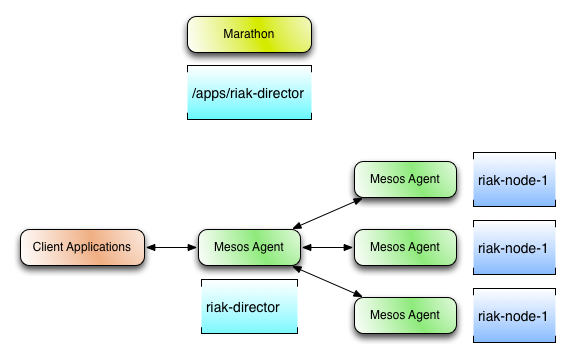

# Riak Mesos Framework [in beta]

An [Apache Mesos](http://mesos.apache.org/) framework for [Riak KV](http://basho.com/products/riak-kv/), a distributed NoSQL key-value data store that offers high availability, fault tolerance, operational simplicity, and scalability.

**Note:** This project is an early proof of concept. The code is a beta release and there may be bugs, incomplete features, incorrect documentation or other discrepancies.

## Installation

Please refer to the documentation in [riak-mesos-tools](https://github.com/basho-labs/riak-mesos-tools) for information about installation and usage of the Riak Mesos Framework.

## Build

For build and testing information, visit [docs/DEVELOPMENT.md](docs/DEVELOPMENT.md).

## Architecture

### Scheduler

The Riak Mesos Framework scheduler will attempt to spread Riak nodes across as many different mesos agents as possible to increase fault tolerance. If there are more nodes requested than there are agents available, the scheduler will then start adding more Riak nodes to existing agents.

### Director

Due to the nature of Apache Mesos and the potential for Riak nodes to come and go on a regular basis, client applications using a Mesos based cluster must be kept up to date on the cluster's current state. Instead of requiring this intelligence to be built into Riak client libraries, a smart proxy application named `Director` has been created which can run alongside client applications.

For more information related to the Riak Mesos Director, please read [docs/DIRECTOR.md](docs/DIRECTOR.md)
