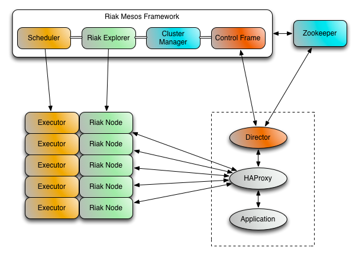

# Riak Mesos Framework Director

Due to the nature of Apache Mesos and the potential for Riak nodes to come and
go on a regular basis, client applications using a Mesos based cluster must
be kept up to date on the cluster's current state. Instead of requiring this
intelligence to be built into Riak client libraries, a smart proxy application named
`Director` has been created which can run alongside client applications.

The Director communicates with Zookeeper to keep up to date with Riak cluster changes.
The Director in turn will update it's list of balanced Riak connections.

## HTTP API

After locating your Director's address in Mesos, the HTTP API can be utilized:

Name | Method | Path | Description
--- | --- | --- | ---
status | **GET** | `/status` | Display current information about the director
configure | **PUT** | `/frameworks/{framework}/clusters/{cluster}` | Changes the framework and cluster names
listFrameworks | **GET** | `/frameworks` | Lists the currently known Riak Mesos Framework instances
listClusters | **GET** | `/clusters` | Lists the clusters for the configured framework
listNodes | **GET** | `/nodes` | Lists the nodes for the configured cluster
healthCheck | **GET** | `/health` | Simple status check for other services like Marathon
